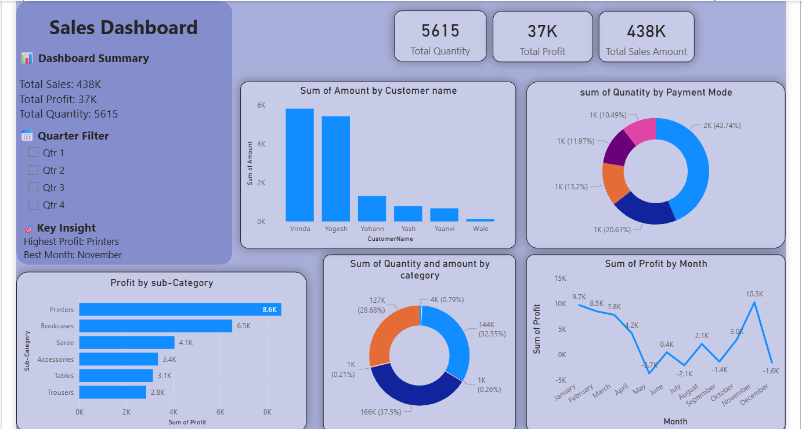

# 📊 Sales Dashboard - Power BI

## 📌 Project Overview
This Power BI Sales Dashboard provides an interactive analysis of sales performance, profit trends, customer behavior, and payment modes. The dashboard helps businesses monitor key performance indicators (KPIs) and make data-driven decisions.

## 🛠️ Tools Used
- Power BI
- Microsoft Excel

## 📷 Dashboard Preview

## 🚀 Key Features
- KPI Cards for Total Sales, Profit, and Quantity
- Quarter-wise Sales Filter
- Customer Sales Analysis
- Payment Mode Distribution
- Category-wise Profit Analysis
- Monthly Profit Trend Analysis
- Interactive Dashboard Design

## 📈 Key Insights
- 💰 Total Sales: 438K
- 📊 Total Profit: 37K
- 📦 Total Quantity Sold: 5615
- 🏆 Highest Profit Category: Printers
- 📅 Best Performing Month: November

## 📂 Dataset Files
- Orders.csv
- Details.csv

## 🎯 Business Benefits
This dashboard helps in:
- Tracking sales performance
- Identifying profitable categories
- Understanding customer purchasing patterns
- Monitoring monthly profit trends
- Supporting business decision-making

## 🔗 Project Files
- Power BI Dashboard (.pbix)
- Dataset Files (.csv)
- Dashboard Screenshot (.png)
